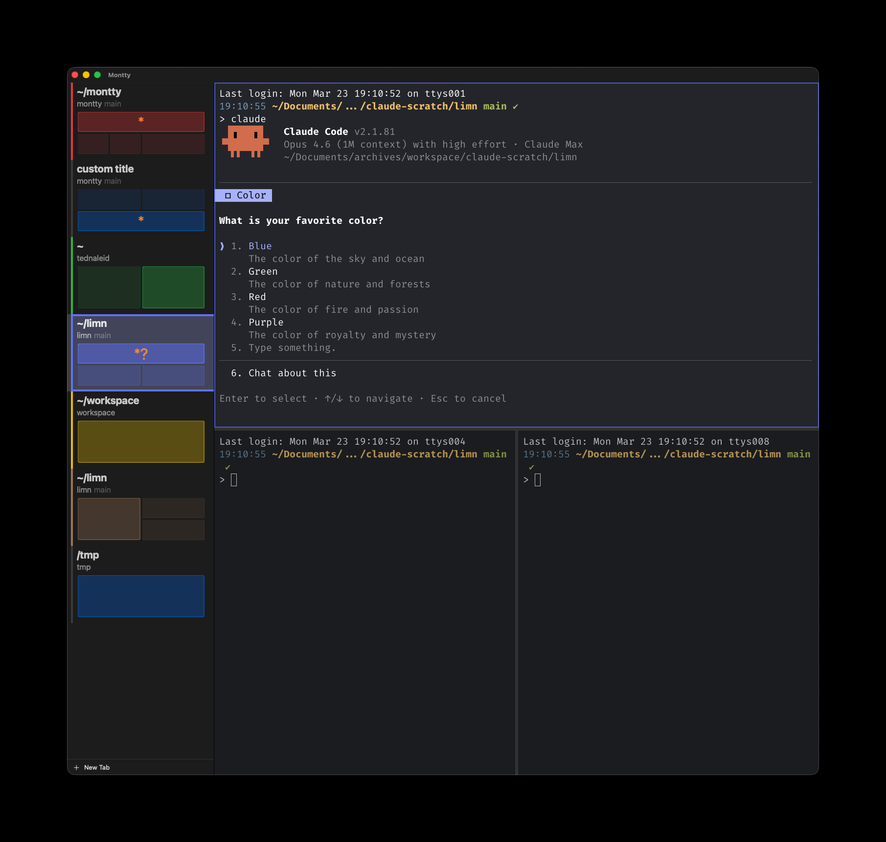
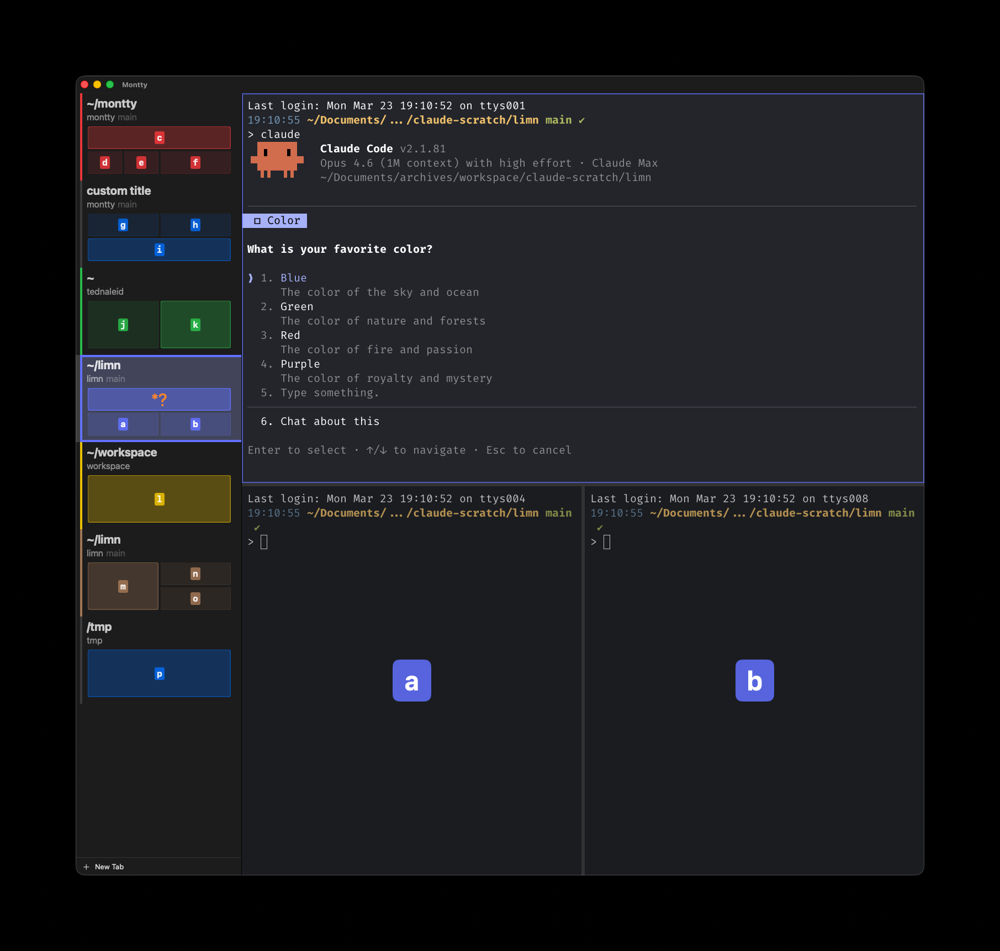

# Montty

A macOS terminal app built on [GhosttyKit](https://github.com/ghostty-org/ghostty) (MIT licensed) with vertical tabs, splits, and session persistence.



## Features

- Vertical tab sidebar with large, scannable names, and a minimap of terminal surfaces across tabs
- Per-tab color coding (user-assignable or auto from directory)
- Horizontal and vertical splits within tabs
- Session restore (tabs, splits, names, colors, focus state survive restart)
- Click any minimap pane to jump directly to that surface
- Git branch and directory info in tab sidebar
- Claude Code status indicators (working, waiting, idle) on minimap panes
- Standard Ghostty theming from `~/.config/ghostty/config`
- Surface jump (Cmd+;) for ace-jump/easy-motion style navigation across all panes

Easy Motion allows movement directly to any terminal surface across tabs:



## Install

### Homebrew

```bash
brew install --cask tednaleid/montty/montty
```

To upgrade to the latest version:

```bash
brew update && brew upgrade --cask montty
```

### Manual download

Download the latest DMG from [Releases](https://github.com/tednaleid/montty/releases).

## Build from source

Requires macOS 14+, Xcode, [zig](https://ziglang.org/) 0.15.2, and [just](https://github.com/casey/just).

```bash
just setup      # init submodules, build GhosttyKit
just build      # compile the app
just run        # build and launch
just test       # run unit tests
just lint        # run SwiftLint
```

## Configuration

Terminal theming is configured through Ghostty's config file at `~/.config/ghostty/config`. Tab state (names, colors, positions, splits) is persisted automatically in a session file. No separate montty config file is needed.

The surface jump shortcut (default Cmd+;) can be changed through macOS System Settings under Keyboard, Keyboard Shortcuts, App Shortcuts. Add an entry for Montty with the menu title "Jump to Surface".

## Architecture

- `Sources/Ghostty/` contains MIT-licensed Swift bindings copied from Ghostty. Modifications are marked with `// MONTTY:` comments.
- `Sources/Model/` contains the data model (tabs, splits, session snapshots, jump labels). This is where most testable logic lives.
- `Sources/View/` contains SwiftUI views.
- `Sources/App/` contains the app entry point, AppDelegate, and servers (debug HTTP, hook socket).

## License

MIT. See [LICENSE](LICENSE).

GhosttyKit is used under its MIT license. The Ghostty submodule at `ghostty/` is MIT licensed.
