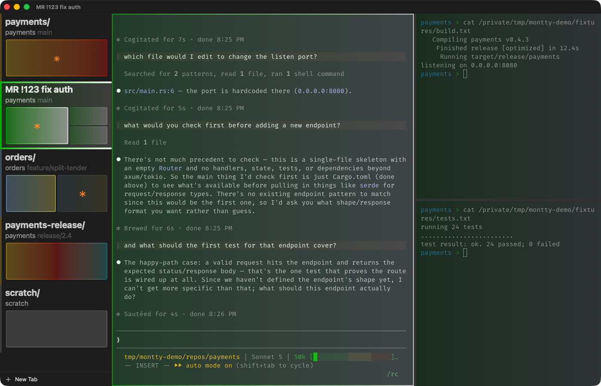
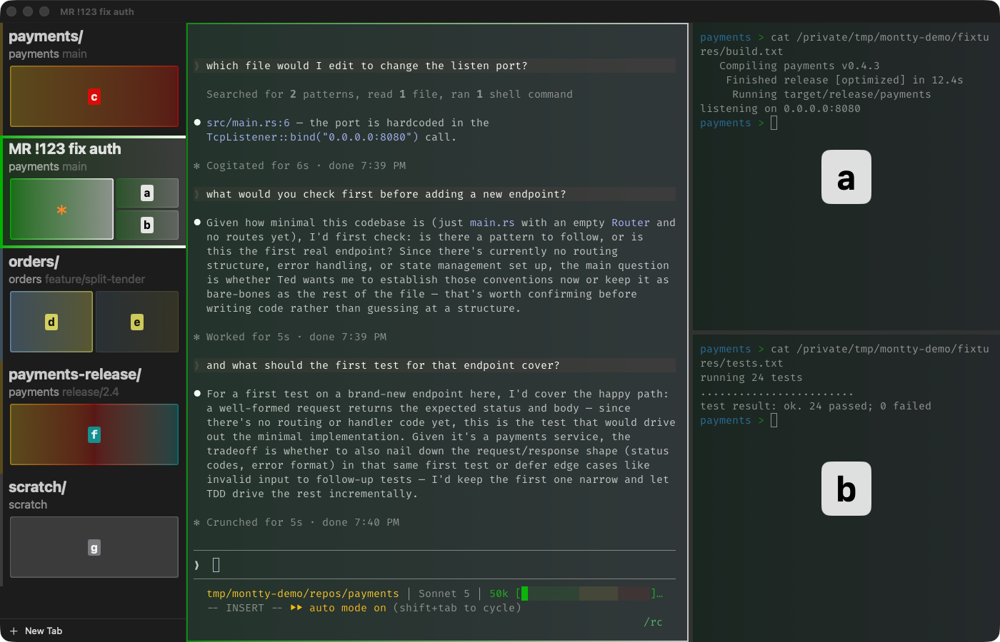

# Montty

A macOS terminal app built on [GhosttyKit](https://github.com/ghostty-org/ghostty) (MIT licensed) with vertical tabs, splits, and session persistence.



## Features

- Vertical tab sidebar with large, scannable names, and a minimap of terminal surfaces across tabs
- Per-tab color coding (user-assignable or auto from directory)
- Horizontal and vertical splits within tabs
- Session restore (tabs, splits, names, colors, focus state survive restart)
- Click any minimap pane to jump directly to that surface
- Git branch and directory info in tab sidebar
- Claude Code status indicators (working, waiting, idle) on minimap panes
- Standard Ghostty theming from `~/.config/ghostty/config`
- Surface jump (Cmd+;) for ace-jump/easy-motion style navigation across all panes

Easy Motion allows movement directly to any terminal surface across tabs:



## Install

### Homebrew

```bash
brew install --cask tednaleid/montty/montty
```

To upgrade to the latest version:

```bash
brew update && brew upgrade --cask montty
```

### Manual download

Download the latest DMG from [Releases](https://github.com/tednaleid/montty/releases).

## Build from source

Requires macOS 14+, Xcode, [zig](https://ziglang.org/) 0.15.2, and [just](https://github.com/casey/just).

```bash
just setup      # init submodules, build GhosttyKit
just build      # compile the app
just run        # build and launch
just test       # run unit tests
just lint        # run SwiftLint
```

## Configuration

Terminal theming is configured through Ghostty's config file at `~/.config/ghostty/config`. Tab state (names, colors, positions, splits) is persisted automatically in a session file. No separate montty config file is needed.

### Session files

The session lives in `~/Library/Application Support/montty/`. Setting `MONTTY_SESSION_DIR` points montty at a different directory, which is how a development build keeps its tabs out of the installed app's session.

The windows open when montty quits are the windows it restores on the next launch. A window closed by hand before quitting is not saved, so it does not come back.

| File | Meaning |
|---|---|
| `session.json` | the live session: tabs, splits, names, colors, focus |
| `session.corrupt-<timestamp>.json` | a `session.json` montty could not read, moved aside before the first save overwrote it |
| `session.v<n>.json` | a copy of a session written in an older format, kept before montty upgrades it |

If montty opens with tabs missing, look for those two recovery files. Quitting montty and copying one back over `session.json` restores what it holds.

### One instance

Before montty starts, it takes an exclusive lock on `MONTTY_SOCKET` with `.lock` appended, and holds it until the process ends. A launch that finds the lock held raises every window of the running instance and exits. The kernel hands that lock to one process at a time, so two launches cannot both pass it however closely they are timed, and it releases the lock when the holder dies for any reason, so a lock file left on disk is never a stale lock.

With the lock in hand, montty then asks whatever is listening on the socket whether it is a montty, and exits the same way if one answers. That finds the owner the lock cannot: a montty from a build older than the lock. Only a live answer counts, so the socket file a crash leaves behind is taken over as it always was.

If the lock cannot be taken for any reason other than another montty holding it, montty logs why and launches with that question as its only guard. Refusing to start would be worse than the collision the lock prevents.

Both are scoped to the socket path, so a build with its own `MONTTY_SOCKET` runs alongside an installed montty. That is what `just run` sets, along with `MONTTY_SESSION_DIR`. Two montty processes sharing a socket would each rebind it, sending every hook and `montty` command to the newer one, and each would autosave over the same `session.json`.

The surface jump shortcut (default Cmd+;) can be changed through macOS System Settings under Keyboard, Keyboard Shortcuts, App Shortcuts. Add an entry for Montty with the menu title "Jump to Surface".

## Architecture

- `Sources/Ghostty/` contains MIT-licensed Swift bindings copied from Ghostty. Modifications are marked with `// MONTTY:` comments.
- `Sources/Model/` contains the data model (tabs, splits, session snapshots, jump labels). This is where most testable logic lives.
- `Sources/View/` contains SwiftUI views.
- `Sources/App/` contains the app entry point, AppDelegate, and servers (debug HTTP, hook socket).

## License

MIT. See [LICENSE](LICENSE).

GhosttyKit is used under its MIT license. The Ghostty submodule at `ghostty/` is MIT licensed.
